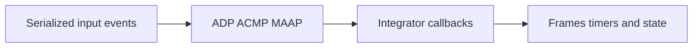

# tsn-c-stack

Portable C11 cores for ADP advertising, Milan ACMP and MAAP allocation.
The library uses fixed storage and callbacks. It needs no heap or operating system.
It has no mailbox, register-map or image dependency.

The code comes from [milan-fpga](https://github.com/kebag-logic/milan-fpga)
under [issue 697](https://github.com/kebag-logic/milan-fpga/issues/697).
The [import record](docs/IMPORT.md) describes the boundary and history.
SRP is supplied separately by [lwSRP](https://github.com/kebag-logic/lwSRP),
under its own [Apache-2.0 licence](https://github.com/kebag-logic/lwSRP/blob/main/LICENSE).
No SRP checkout is needed to build or test these cores.

## Build and test

Install a C11 compiler, a C++20 compiler, [CMake](https://cmake.org/),
[GoogleTest and GMock 1.14.0](https://github.com/google/googletest), and Python 3.10 or later.
On Ubuntu, the test packages are `libgtest-dev` and `libgmock-dev`.

```sh
cmake -S . -B build -DCMAKE_BUILD_TYPE=Debug
cmake --build build -j16
ctest --test-dir build --output-on-failure -j16
```

The library-only build uses `-DTSN_TESTS=OFF` and target `tsn`.
Use `-DCMAKE_C_COMPILER=clang -DCMAKE_CXX_COMPILER=clang++` for Clang.
Both compilers use `-Wall -Wextra -Werror` and ISO C11.
The tests use C++20. The library exposes C headers in [include](include/).

Linux and bare-metal RV32 are required targets for every change.
Linux runs the full GoogleTest suite with GCC and Clang, sanitizers and coverage.
The [RV32 gate](scripts/baremetal.py) builds and links all cores against a
[minimal port](examples/rv32/) in Debug and Release. It executes protocol smoke
checks on [QEMU](https://www.qemu.org/).

On Ubuntu, install `gcc-riscv64-unknown-elf`, `binutils-riscv64-unknown-elf`,
`qemu-system-misc` and CMake. Then run:

```sh
python3 scripts/baremetal.py --work build-rv32 --jobs 16
```

The cross build uses `-march=rv32i -mabi=ilp32 -ffreestanding`.
It has no OS headers, heap or unresolved final symbols.
The [workflow](.github/workflows/quality.yml) requires both target jobs on every PR.
See [port obligations](docs/PORTING.md#target-builds) and [validation limits](docs/VERIFICATION.md#bare-metal-rv32).

## Choose a task

| Persona | Start here |
|---|---|
| Developer | Read the [architecture](docs/ARCHITECTURE.md), [coding standard](docs/CODING_STANDARD.md), and [contribution rules](CONTRIBUTING.md). |
| Integrator | Read the [port contract](docs/PORTING.md) and run the [example port](examples/adp_port.c). |
| Tester | Run the [verification commands](docs/VERIFICATION.md). Check [traceability](docs/TRACEABILITY.md) and [test defects](docs/TESTS.md). |
| Manager | Review the [requirements](docs/REQUIREMENTS.md), [deviations](docs/DEVIATIONS.md), [change log](CHANGELOG.md), and two independent reviews. |



## Licence

[MIT](LICENSE). Copyright 2026 Kebag Logic.
See [security reporting](SECURITY.md) for defect handling.
