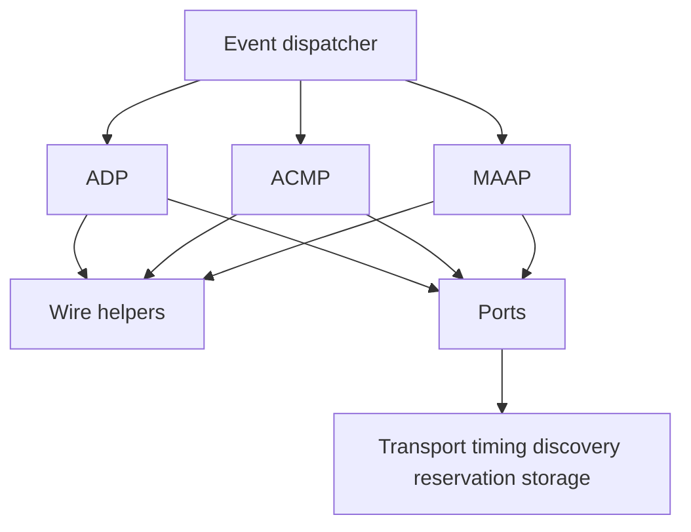
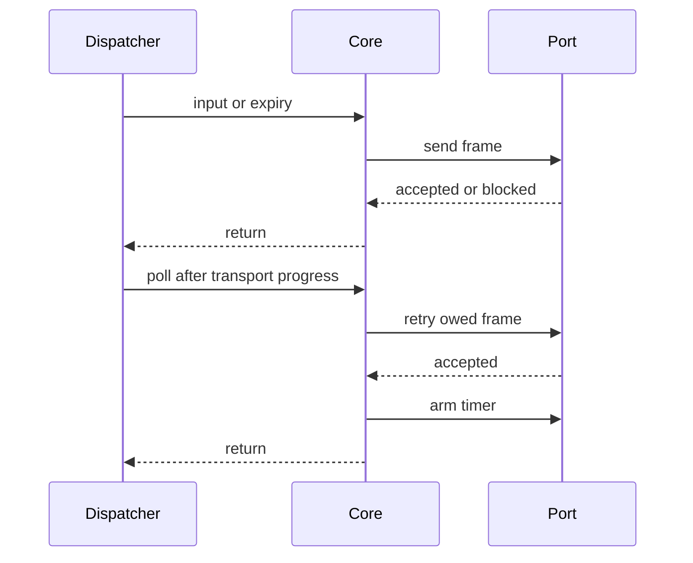

# Architecture

The library is a set of state machines. The integrator owns every instance.
Calls finish synchronously. Callbacks provide external state and output.
The [public headers](../include/) define the storage and signatures.
The [porting guide](PORTING.md) defines timing and ownership.

| Module | Responsibilities | Storage |
|---|---|---|
| [ADP](../include/adp.h) | Advertise one interface. Process discovery requests and link changes. | One instance per interface. Two owed departures and one owed advertisement. |
| [ACMP](../include/acmp.h) | Listener binding, discovery, probing, talker replies, saved binding records. | Fixed sink, source, interface and response arrays. |
| [MAAP](../include/maap.h) | Acquire, defend and release one multicast range. | One instance per range and interface. Sixteen pending frames. |
| [Wire](../include/wire.h) | Read and write big-endian fields without unaligned loads. | Caller-owned buffers. |

The dispatcher presents untagged Ethernet frames to the relevant receiver.
ADP advertisements from remote talkers also reach ACMP discovery.
The dispatcher supplies link edges, grandmaster changes, timer expiries and
reservation feedback. It calls each poll function while output remains owed.
Callbacks may copy output into bounded transport storage. They return promptly.
They never deliver a new core event before returning.

ADP guards port calls across instances. ACMP and MAAP guard each active instance.
These guards detect integration errors. They are not locks.
There is one dispatch context. Interrupts queue events for that context.
ACMP deadlines use unsigned millisecond clocks and signed wrap comparisons.
ADP and MAAP request relative delays. The adapter owns expiry cancellation.

The cores do not call one another. Reservation, allocation, persistence and
notification connections are supplied by the integrator.
The [requirements](REQUIREMENTS.md) trace protocol behavior.
The [deviations](DEVIATIONS.md) delimit the supported profile.
