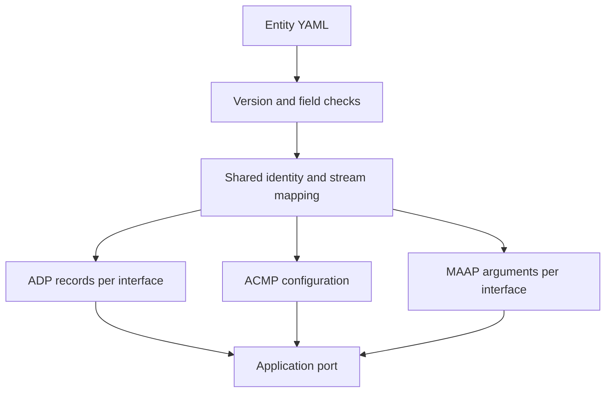

# Entity YAML

Describe one static entity in YAML. Generate its C configuration on the host.
The [generator](../scripts/entity_yaml.py) needs Python 3.10 or later and [PyYAML](https://pyyaml.org/wiki/PyYAMLDocumentation).
The generated files need only the [portable headers](../include/).
They contain const initializers. They allocate no runtime memory.



## Integration

For an integrator, start with the [listener](../configs/listener.yaml),
[talker](../configs/talker.yaml), or [duplex](../configs/duplex.yaml) example.
The duplex has two interfaces. Its first input uses interface 1.
The [AX7101 example](../configs/ax7101.yaml) preserves the mapped firmware identity.
Example identities are demonstration values. Assign unique production identities.
The vendor owns model identity when the complete descriptor model changes.

```sh
python3 scripts/entity_yaml.py configs/duplex.yaml --output build-entity --prefix entity
```

Compile the resulting `entity_config.c` and include `entity_config.h` in the port.
For each interface `i`, pass `&entity_adp[i]` to `adp_init`, with interface `i` and configuration index zero.
Pass `&entity_acmp` to `acmp_init`.
For each `entity_maap[i]` with nonzero `count`, pass its `interface`, `mac`, and `count` to `maap_init`.
Pass its `preferred` value to `maap_begin` when transport is ready.
An interface with no outputs has a zero-count record. Do not initialize MAAP from that record.
Keep mutable core instances and callback tables in application storage.
The [porting guide](PORTING.md#ownership-and-dispatch) defines their lifetime and dispatch rules.

The schema describes one configuration, audio and media-clock streams, and at most four interfaces.
It does not generate AEM descriptors, media formats, SRP configuration, redundancy pairs, or controller behavior.
The application must implement the features it advertises, including AEM and Identify.
The [supported profile](DEVIATIONS.md) and [port obligations](PORTING.md#entity-configuration) still apply.
Stream list order supplies the ACMP unique ID. Interface list order supplies the AVB interface index.
This is a single-configuration subset of the maximum-count rules in [Milan v1.2 5.6.2][milan].

## Schema 1.0.0

All listed fields are required. Unknown keys are refused at every level.
No field has a silent default. Empty stream and MAAP lists are explicit.
Integer fields accept YAML integer scalars, including hexadecimal notation.
Booleans, floats and quoted integers are refused.
Quote MAC addresses and names. Strings use UTF-8 and cannot contain control characters.
The parser refuses duplicate keys, aliases, merge keys, custom tags and multiple documents.

The container names and version are local conventions from [issue 2][issue].
The clauses below define the represented protocol facts.
Local capacity limits are stricter than their wire fields.

| Field | Range and meaning | Authority |
|---|---|---|
| `schema_version` | String `1.0.0` only. Local format version. | [Issue 2][issue] |
| `identity` | Mapping containing the six fields below. | [IEEE 1722.1-2021 7.2.1][atdecc] |
| `identity.entity_id` | Integer 1 through 2^64-2, or `mac-derived`. Derive from interface 0 by inserting FF FE after its first three MAC octets. Preserve the U/L bit. | [IEEE 1722.1-2021 6.2.2.7][atdecc]; [source identity policy](PORTING.md#entity-configuration) |
| `identity.model_id` | Integer 1 through 2^64-2. Resolve the complete product model outside this generator. | [IEEE 1722.1-2021 6.2.2.8][atdecc]; [Milan v1.2 5.6.2][milan] |
| `identity.name` | 0 through 64 UTF-8 bytes. Entity name metadata. | [IEEE 1722.1-2021 7.2.1][atdecc] |
| `identity.vendor_name` | 0 through 64 UTF-8 bytes. Vendor string metadata. | [IEEE 1722.1-2021 7.2.1 and 7.2.12][atdecc] |
| `identity.serial_number` | 0 through 64 UTF-8 bytes. Serial metadata. | [IEEE 1722.1-2021 7.2.1][atdecc] |
| `identity.group_name` | 0 through 64 UTF-8 bytes. Group metadata. | [IEEE 1722.1-2021 7.2.1][atdecc] |
| `capabilities` | Mapping containing the two fields below. | [IEEE 1722.1-2021 6.2.2.9 and 6.2.2.19][atdecc] |
| `capabilities.entity` | Integer 0 through 0x03FFFFFF. All bits in 0xC588 must be set. All bits in 0x73000 must be clear. | [IEEE 1722.1-2021 Table 6-2][atdecc]; [Milan v1.2 5.6.2][milan]; [authentication policy](PORTING.md#entity-configuration) |
| `capabilities.identify_control_index` | Integer 0 through 65535. Application Identify control index. | [IEEE 1722.1-2021 6.2.2.19][atdecc]; [Milan v1.2 5.3.3][milan] |
| `interfaces` | List of 1 through 4 mappings. Local ACMP capacity. Indices are 0 through length minus one. | [IEEE 1722.1-2021 7.2.8 and 6.2.2.20][atdecc]; [ACMP header](../include/acmp.h) |
| `interfaces[].mac` | Six hexadecimal octets separated by colons. Nonzero, unicast, distinct 48-bit values. | [IEEE 1722.1-2021 7.2.8][atdecc]; [MAAP initialization contract](PORTING.md#callback-checklist) |
| `inputs`, `outputs` | Lists of 0 through 16 stream mappings each. Local ACMP capacity. Indices are consecutive. | [IEEE 1722.1-2021 6.2.2.10, 6.2.2.12 and 7.2.6][atdecc]; [Milan v1.2 5.6.2][milan] |
| `inputs[].name`, `outputs[].name` | 0 through 64 UTF-8 bytes. Source labels for integration. The cores have no stream-name field. | [IEEE 1722.1-2021 7.2.6][atdecc] |
| `inputs[].interface`, `outputs[].interface` | Integer 0 through interface count minus one. | [IEEE 1722.1-2021 7.2.6][atdecc]; [Milan v1.2 5.5.3.5.1][milan] |
| `inputs[].kind`, `outputs[].kind` | `audio` or `clock`. Derive AUDIO or MEDIA_CLOCK capabilities. | [IEEE 1722.1-2021 Tables 6-3 and 6-4][atdecc] |
| `maap` | List of 0 through interface count mappings. Exactly one entry for each interface with outputs. | [IEEE 1722-2016 B.3.2][avtp] |
| `maap[].interface` | Integer 0 through interface count minus one. Must own an output. No duplicates. | [IEEE 1722-2016 B.3.2][avtp]; [local instance contract](PORTING.md#maap-callbacks-and-public-fields) |
| `maap[].preferred` | Integer zero for random allocation, or 0x91E0F0000000 through 0x91E0F000FE00 minus the output count on that interface. Reserve one address per output. | [IEEE 1722-2016 B.3.2, Table B.7, B.4 and Table B.9][avtp] |

ADP and ACMP entity IDs come from the same resolved value.
Every ADP record uses the same model ID, counts and capability bits. Its MAC comes from its own interface.
Talker and listener IMPLEMENTED are set only for a nonempty direction.
AUDIO is set when that direction contains an audio stream. MEDIA_CLOCK is set when it contains a clock stream.
These fields are derived, so the schema has no separately writable counts or direction capabilities.
The generated identity record preserves four strings in 65-byte C arrays, including a trailing NUL.
This record is metadata for the port. It is not an AEM descriptor image.

The MAAP dynamic pool ends before FE00. The source firmware's SRP address FE01 belongs to a different allocation policy.
The mapper requests a random MAAP allocation instead of treating FE01 as a dynamic preferred address.
See [IEEE 1722-2016 B.4 and Tables B.9 and B.10][avtp].

## Validation and tests

For a tester, run the full [verification kit](VERIFICATION.md).
The focused host checks are:

```sh
python3 scripts/entity_yaml.py --examples --check
python3 scripts/entity_selftest.py --work build-entity-controls
python3 scripts/mutation.py --work build-entity-mutations --select entity- --jobs 16
python3 scripts/baremetal.py --work build-rv32 --jobs 16
```

The [schema tests](../scripts/entity_selftest.py) compare exact refusal messages.
Each required field is deleted once. Every mapping receives an unknown-field control.
The range tests cover list capacities, missing interfaces, MAC syntax and uniqueness, names, identity, capabilities and MAAP bounds.
The CLI refuses invalid input with status 2 before writing either output file.
It leaves previous output bytes intact on validation failure.
An I/O failure is reported separately. The two output writes are not an atomic transaction.

Golden checks compare both generated files with the tracked examples byte for byte.
The same input mapping with reordered keys gives the same bytes.
There are no timestamps, source paths or random values in the output.
The schema version appears in the include guard and in a macro.
Each generated source statically asserts that macro's exact version.
A planted stale header fails compilation. Both C11 and C++20 header modes are in the [conditional matrix](CODING_STANDARD.md#conditional-compilation).
The prefix option chooses C symbol names. It accepts a lower-case letter followed by lower-case letters, digits or underscores.
Do not link two configurations with the same prefix.

The [round-trip checks](../examples/entity_roundtrip.c) run through all three cores for all four examples.
The hosted [GoogleTest cases](../tests/test_entity.cpp) and the [RV32 smoke image](../examples/rv32/smoke.c) call the same checks.
Their oracles spell expected fields independently of the generated structs.
ADP checks transmitted fields. ACMP restores bindings and checks interface admission.
MAAP checks probes, counts, preferred ranges, validity and withdrawal.
The [mutation campaign](../tests/mutations.json) plants three named defects:

| Plant | Changed configuration | Required catch |
|---|---|---|
| `entity-wrong-count` | AX7101 ADP source count becomes one. | `EntityYaml.AdpRoundTrip` |
| `entity-swapped-interface` | Duplex sink interfaces are exchanged. | `EntityYaml.AcmpRoundTrip` |
| `entity-dropped-field` | Talker MAAP preferred field is removed. C supplies zero. | `EntityYaml.MaapRoundTrip` |

All three plants still compile. Each must fail its named assertion in a completed run.
The golden test also refuses each planted file as drift.
The [quality workflow](../.github/workflows/quality.yml) runs regeneration and all host checks.
The [RV32 gate](../scripts/baremetal.py) checks each generated object has no imports and only permitted freestanding headers.
The existing [coverage denominator](VERIFICATION.md#measurement-and-limits) stays unchanged and must remain at 100%.
It measures production cores and wire helpers. It does not claim Python generator branch coverage.

## Mapping from milan-fpga

The source is [milan-fpga revision 5603c353](https://github.com/kebag-logic/milan-fpga/tree/5603c353137e90c1fa95429f6d00ef7a2298d9ee).
Its [end-station examples](https://github.com/kebag-logic/milan-fpga/tree/5603c353137e90c1fa95429f6d00ef7a2298d9ee/configs) use schema 1.2.0.
The [ADP generator](https://github.com/kebag-logic/milan-fpga/blob/5603c353137e90c1fa95429f6d00ef7a2298d9ee/sw/firmware/ctrl/adp/adp_entity.py)
uses the [builder](https://github.com/kebag-logic/milan-fpga/blob/5603c353137e90c1fa95429f6d00ef7a2298d9ee/sw/builder/endstation_builder.py).
The [SRP generator](https://github.com/kebag-logic/milan-fpga/blob/5603c353137e90c1fa95429f6d00ef7a2298d9ee/sw/firmware/ctrl/srp/srp_entity.py)
uses that same ADP result for stream counts.

The entity section alone omits MAC and stream shape. Use the documented projection below.
The [mapper](../scripts/milan_entity.py) accepts a full source document and copies only the protocol configuration facts.
Resolve the complete AEM model ID and entity capability value with the source builder first.
This avoids inventing a second hash algorithm for a partial descriptor model.
The manager owns the follow-up that replaces the firmware generators with this interface.

| Source 1.2.0 fact | Portable 1.0.0 field or treatment |
|---|---|
| `entity.entity_id` | `identity.entity_id`. Preserve explicit identity or `mac-derived`. |
| `entity.entity_model_id`, optional `model_id_pin`, `vendor_oui` | `identity.model_id`, resolved by the complete source builder. A literal, pin or OUI must agree with the supplied resolved value. |
| `entity.name`, `vendor_name`, `serial_number`, `group_name` | Corresponding fields in `identity`, unchanged. |
| `entity.locale` | AEM localization only. Retained by the product descriptor generator. No core field. |
| Optional `entity.entity_capabilities` | Must agree with the resolved capability value. Source authority is the [protocol package](https://github.com/Mister-M-alt/protocol-processor-control-plane-avb-milan/blob/2ad2f845dd583f8310075fa2380cb60a04fd091a/hdl/adp/pp_adp_pkg.sv). |
| `platform.mac_address` | `interfaces[0].mac`. The supported projection has one protocol interface. |
| `streams.listeners`, `streams.talkers` | Audio `inputs`, `outputs` in source order, all on interface 0. Preserve stream names. |
| `clocking.crf_sink`, `clocking.crf_output.enabled` | Append one clock input or output when true. Omitted source `crf_output` means disabled. |
| Stream channel counts, formats and map modes | Kept in the source AEM and media generators. No fields in these cores. |
| Source Identify descriptor | Index zero, as checked by the source ADP generator. |
| `srp.stream_dmac_base` | No direct MAAP mapping. Request random dynamic allocation. |
| Board, SoC, gPTP dataset, transport, audio and reservation fields | Remain product responsibilities. They are outside this projection. |

The [AX7101 fact fixture](../configs/compat/ax7101.json) records the source hash and size, selected input facts, and all nine old ADP values.
The mapping test produces the tracked AX7101 YAML exactly and checks every ADP value.
One audio plus one CRF stream gives two inputs and two outputs.
Both stream capability values are 0x4801. Entity capabilities are 0xC588.
Its model ID is 0x001BC5C1935893E1 and its entity ID is 0x020000FFFE000001.

For the pinned AX7101 source, run:

```sh
python3 scripts/milan_entity.py source/configs/endstation_ax7101_1x1_tdm8.yaml --model-id 0x001BC5C1935893E1 --capabilities 0xC588 --output build-ax7101.yaml
python3 scripts/entity_yaml.py build-ax7101.yaml --output build-ax7101 --prefix ax7101
```

The mapper refuses unsupported source versions, unknown entity fields, missing projection inputs, conflicting model identity or capabilities, and non-boolean CRF enables.
Other source sections are intentionally outside its validation scope.
Validate the complete product configuration with its own builder before projecting it.
The live source generators and all five end-station shapes were inspected for this mapping.
No platform source change is part of this repository change.

For a developer, keep the [generator](../scripts/entity_yaml.py), [examples](../configs/),
[goldens](../examples/entities/), [host controls](../scripts/entity_selftest.py), and [schema table](#schema-100) together.
Regenerate intentional changes with:

```sh
python3 scripts/entity_yaml.py --examples
```

YAML stays outside the four directories with the [closed suffix contract](CODING_STANDARD.md).
Generated C comments use only SPDX, requirement IDs and short clause references.
Any change requiring core behavior belongs in a separate core issue.

[atdecc]: https://standards.ieee.org/ieee/1722.1/6670/
[milan]: https://avnu.org/resource/milan-specification/
[avtp]: https://standards.ieee.org/ieee/1722/5979/
[issue]: https://github.com/kebag-logic/tsn-c-stack/issues/2
