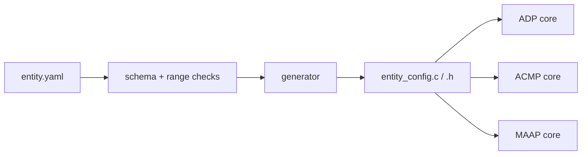

Issue authority: https://github.com/kebag-logic/tsn-c-stack/issues/2

Specify an entity for the stack in a YAML file, and generate the C configuration from it. Integrators should describe an entity, not hand-write C structs.

## Today

- The cores take the entity as C structs that the integrator fills in:
  - `struct adp_entity`: entity ID, model ID, MAC, capabilities, source and sink counts, identify control.
  - `struct acmp_config`: interfaces, their MACs, sinks, sources and each one's interface.
  - The MAAP configuration.
- The same facts must agree across the three structs, but nothing checks that they do.
- [milan-fpga](https://github.com/kebag-logic/milan-fpga) already describes its end-station in YAML. Its `configs/endstation_*.yaml` files have an `entity:` section (`schema_version` 1.2.0), and Python generators (`sw/firmware/ctrl/adp/adp_entity.py`, `srp/srp_entity.py`) derive the C fields from it. That generator lives in milan-fpga, not in the stack.

## Goal

- One YAML file describes an entity. One generator in this repository turns it into a C configuration that every core consumes.
- Shared facts (entity ID, MACs, interface counts, stream counts and mapping) are written once, so the cores cannot disagree.

## Acceptance

1. **Schema.** A documented, versioned YAML schema for the entity:
   - identity: entity ID or a derivation rule, model ID or a derivation rule, names, vendor and serial;
   - capabilities;
   - interfaces and their MACs;
   - stream inputs and outputs with their interface;
   - MAAP settings.
   Each field names the clause it comes from (IEEE 1722.1-2021, Milan v1.2, IEEE 1722-2016 Annex B), and the schema states each field's range.
2. **Validation.** The generator refuses an invalid entity with a precise message: out-of-range counts, a sink on an interface that does not exist, a missing MAC, an unknown field or an unsupported schema version. Each refusal has a test.
3. **Generator.** It emits `const` C initialisers for `adp_entity`, `acmp_config` and the MAAP configuration, deterministically (the same YAML gives the same bytes). It needs no heap at runtime. A header guards the schema version.
4. **Tests.** A golden test regenerates the example entities and requires byte equality. A round-trip test feeds a generated configuration through each core's unit tests. Planted defects (a swapped interface, a wrong count) are refused or caught. Coverage stays at 100 %.
5. **CI.** The quality workflow regenerates the examples and fails on drift.
6. **Docs.** `docs/ENTITY_YAML.md` documents the schema with examples per persona and a Mermaid graph. `docs/PORTING.md` shows YAML as the integration path, with hand-written structs kept as the low-level option.
7. **Compatibility with milan-fpga.** Either the schema accepts the `entity:` section of milan-fpga's end-station YAML unchanged, or a documented mapping covers the difference. A follow-up milan-fpga issue then makes milan-fpga use this generator, so there is a single source.

Depends on PR #1 (import of the cores). Relates to [kebag-logic/milan-fpga#697](https://github.com/kebag-logic/milan-fpga/issues/697).

